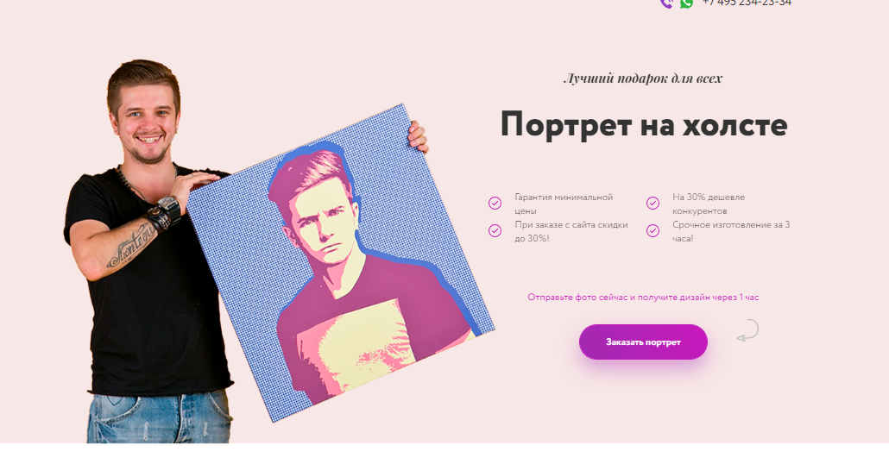
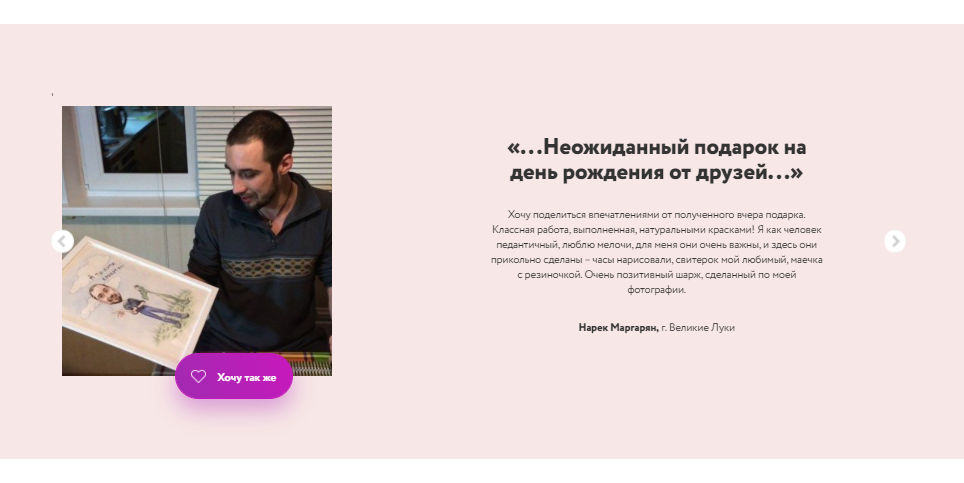
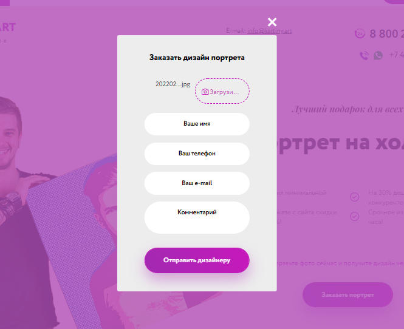
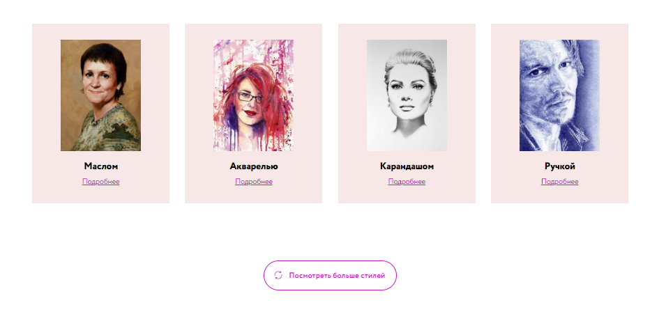
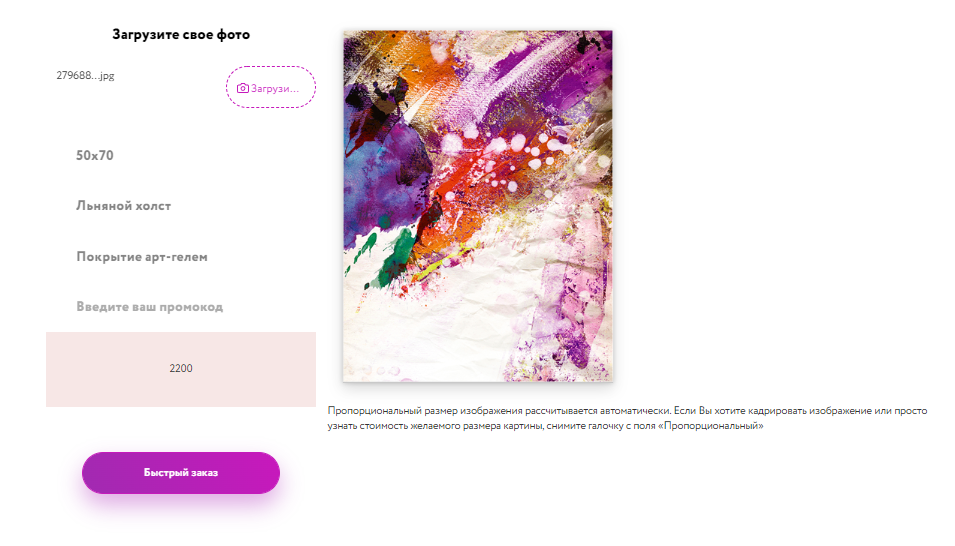
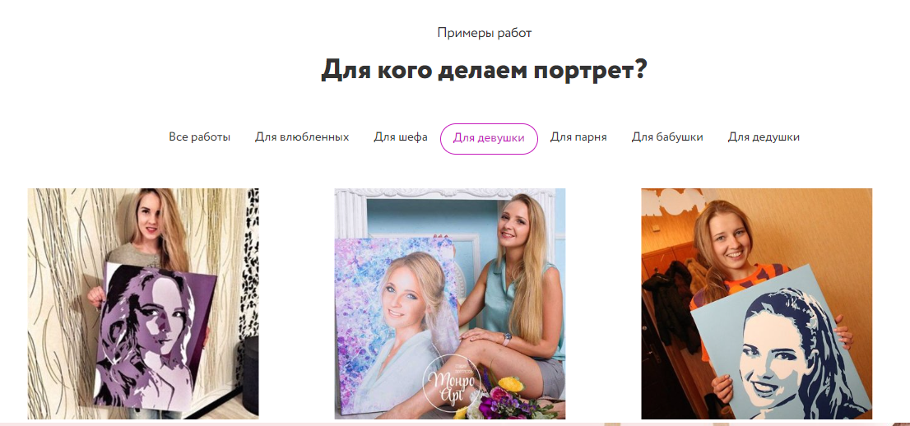
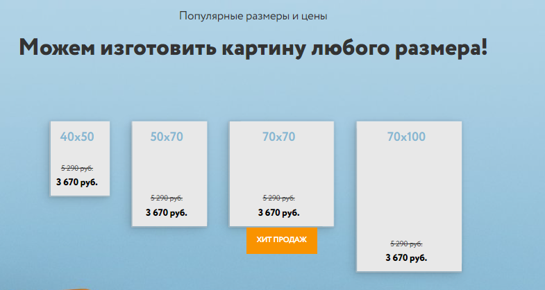
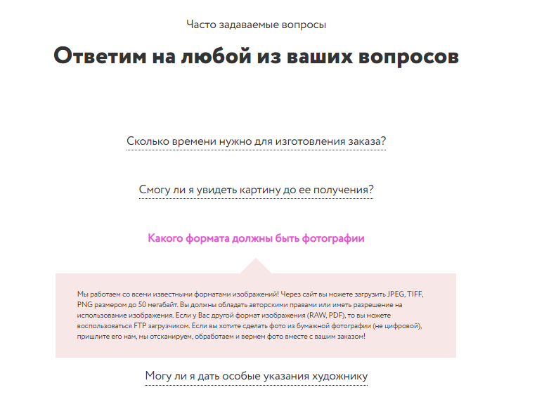
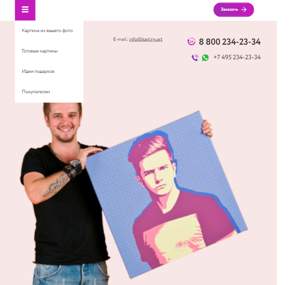

# Portfolio---Art 
https://dv-nn.github.io/Portfolio---Art/  

:white_check_mark: Создание слайдера горизонтального и вертикального(JS)        
:white_check_mark: Реализация отправки формы посредством ajax, оповещение пользователя, валидация номера телефона  
:white_check_mark: Реализация Drag & Drop загрузки изображений    
:white_check_mark: Модальное окно - промокод  
:white_check_mark: Реализация подгрузки элементов на страницу    
:white_check_mark: Калькулятор - расчет стоимости работы      
:white_check_mark: Реализация фильтрации элементов    
:white_check_mark: Замена изображения при наведении  
:white_check_mark: Реализация меню-аккордеон    
:white_check_mark: Создание бургер-меню    
:white_check_mark: Создание плавного скролла на сайте  

# Стек:      
- HTML          
- CSS   
- Bootstrap        
- JS         
- Webpack   
- Gulp  
     
# Screenshot:      
        
      
      
      
      
 
  
 
 
 
